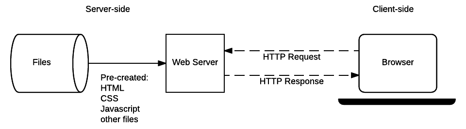

# APLIKASI MENEJEMEN SISWA
Aplikasi Manajemen Kesiswaan adalah sistem berbasis web yang digunakan untuk mengelola data siswa secara digital dan terstruktur. Aplikasi ini menggunakan Node.js sebagai backend untuk mengatur server, autentikasi, dan API, sedangkan frontend digunakan untuk menampilkan antarmuka yang responsif dan mudah digunakan. Fitur utama meliputi login pengguna, pengelolaan profil siswa, penyimpanan data, dan informasi akademik. Struktur project dipisahkan antara folder public dan assets agar pengembangan lebih rapi dan mudah dipelihara. Sistem ini membantu sekolah mempercepat proses administrasi, mengurangi kesalahan pencatatan manual, meningkatkan keamanan data, serta mempermudah akses informasi siswa secara real-time melalui browser.



***

```struktur folder
MenejemenKesiswaan/
├── app.js
├── public/
│   ├── index.html
│   ├── auth.html
│   └── profile.html
└── src/
    └── assets/
        ├── js/
        │   ├── index.js
        │   ├── auth.js
        │   └── profile.js
        ├── css/
        │   ├── style.css
        │   ├── auth.css
        │   └── profile.css
        └── image/
            ├── logo.png
            ├── banner.png
            └── background-default.jpg
```

Struktur project ini bekerja dengan membagi sistem menjadi dua bagian utama, yaitu server-side dan client-side. File `app.js` berfungsi sebagai pusat backend yang menjalankan server Node.js dan mengatur routing, API, serta pengiriman halaman ke browser. Ketika pengguna membuka aplikasi, server akan menampilkan file HTML dari folder `public` seperti `index.html`, `auth.html`, atau `profile.html`. Folder public digunakan untuk halaman utama yang langsung diakses pengguna melalui browser.

Di dalam folder `src/assets`, terdapat folder `js`, `css`, dan `image` yang berfungsi menyimpan seluruh aset frontend agar project lebih rapi dan modular. Folder `js` digunakan untuk logika client-side seperti validasi form login atau manipulasi tampilan halaman. Folder `css` mengatur desain dan tampilan aplikasi agar responsif dan nyaman digunakan. Folder `image` menyimpan gambar seperti logo, banner, atau avatar pengguna.

Saat aplikasi dijalankan, backend akan membaca request dari pengguna, memproses data, lalu mengirim response berupa halaman HTML beserta file CSS dan JavaScript yang dibutuhkan. Dengan struktur ini, pengembangan menjadi lebih terorganisir, mudah dipelihara, dan siap dikembangkan menjadi aplikasi manajemen kesiswaan yang lebih kompleks menggunakan database dan API.

***

Menggunakan database `PostgreSQL` berbasis cloud dari [Neon Tech](https://neon.tech) dengan sistem otomatisasi pada `app.js` untuk menginisialisasi database saat server dijalankan.

```app.js
const pool = new Pool({
  connectionString: process.env.DATABASE_URL,
  ssl: { rejectUnauthorized: false },
  max: 20,
  min: 2,
  idleTimeoutMillis: 30000,
  connectionTimeoutMillis: 10000,
  allowExitOnIdle: true,
});

async function initTables() {
  const createAdminTable = `
    CREATE TABLE IF NOT EXISTS AdminMenejemenKesiswaan (
      id         SERIAL PRIMARY KEY,
      username   VARCHAR(100) NOT NULL UNIQUE,
      password   TEXT NOT NULL,
      email      VARCHAR(150) UNIQUE,
      created_at TIMESTAMP DEFAULT NOW(),
      updated_at TIMESTAMP DEFAULT NOW()
    );
  `;

  const createSiswaTable = `
    CREATE TABLE IF NOT EXISTS DataMenejemenSiswa (
      id           SERIAL PRIMARY KEY,
      nisn         VARCHAR(20) NOT NULL UNIQUE,
      nama_lengkap VARCHAR(200) NOT NULL,
      gender       VARCHAR(20) NOT NULL CHECK (gender IN ('Laki-laki', 'Perempuan')),
      kelas        VARCHAR(20) NOT NULL,
      jurusan      VARCHAR(100) NOT NULL,
      no_tlpn      VARCHAR(20),
      foto_profil  TEXT,
      status       VARCHAR(20) NOT NULL DEFAULT 'aktif' CHECK (status IN ('aktif', 'pindah', 'lulus', 'nonaktif')),
      created_at   TIMESTAMP DEFAULT NOW(),
      updated_at   TIMESTAMP DEFAULT NOW()
    );
  `;

  try {
    await pool.query(createAdminTable);
    await pool.query(createSiswaTable);
    console.log("[DB] Tables initialized successfully");
  } catch (err) {
    console.error("[DB] Table initialization failed:", err.message);
    process.exit(1);
  }
}
```

Menggunakan sistem REST API berbasis `Express.js` untuk mengelola data admin dan siswa secara dinamis melalui metode `GET`, `POST`, `PUT`, dan `DELETE`. Endpoint admin digunakan untuk menampilkan, menambahkan, mengubah, dan menghapus data administrator dengan validasi username serta email unik. Endpoint siswa mendukung pengelolaan data siswa lengkap, pencarian berdasarkan nama, filtering kelas, jurusan, dan status siswa secara realtime menggunakan query parameter. Seluruh proses terhubung langsung dengan database `PostgreSQL` menggunakan query parameterized untuk meningkatkan keamanan dari SQL Injection serta dilengkapi sistem validasi, status response HTTP, dan error handling otomatis pada setiap request API.

```app.js
app.get("/api/data/admin", async (req, res) => {
  try {
    const result = await pool.query(
      "SELECT id, username, email, created_at, updated_at FROM AdminMenejemenKesiswaan ORDER BY id ASC"
    );
    res.json({ success: true, data: result.rows });
  } catch (err) {
    res.status(500).json({ success: false, message: err.message });
  }
});

app.post("/api/data/admin", async (req, res) => {
  const { username, password, email } = req.body;
  if (!username || !password) {
    return res.status(400).json({ success: false, message: "Username dan password wajib diisi" });
  }
  try {
    const result = await pool.query(
      `INSERT INTO AdminMenejemenKesiswaan (username, password, email)
       VALUES ($1, $2, $3)
       RETURNING id, username, email, created_at`,
      [username, password, email || null]
    );
    res.status(201).json({ success: true, data: result.rows[0] });
  } catch (err) {
    if (err.code === "23505") {
      return res.status(409).json({ success: false, message: "Username atau email sudah digunakan" });
    }
    res.status(500).json({ success: false, message: err.message });
  }
});

app.put("/api/data/admin/:id", async (req, res) => {
  const { id } = req.params;
  const { username, password, email } = req.body;
  try {
    const result = await pool.query(
      `UPDATE AdminMenejemenKesiswaan
       SET username = COALESCE($1, username),
           password = COALESCE($2, password),
           email    = COALESCE($3, email),
           updated_at = NOW()
       WHERE id = $4
       RETURNING id, username, email, updated_at`,
      [username || null, password || null, email || null, id]
    );
    if (result.rowCount === 0) {
      return res.status(404).json({ success: false, message: "Admin tidak ditemukan" });
    }
    res.json({ success: true, data: result.rows[0] });
  } catch (err) {
    res.status(500).json({ success: false, message: err.message });
  }
});

app.delete("/api/data/admin/:id", async (req, res) => {
  const { id } = req.params;
  try {
    const result = await pool.query(
      "DELETE FROM AdminMenejemenKesiswaan WHERE id = $1 RETURNING id",
      [id]
    );
    if (result.rowCount === 0) {
      return res.status(404).json({ success: false, message: "Admin tidak ditemukan" });
    }
    res.json({ success: true, message: "Admin berhasil dihapus" });
  } catch (err) {
    res.status(500).json({ success: false, message: err.message });
  }
});
```

startServer() digunakan sebagai sistem startup utama aplikasi untuk menjalankan inisialisasi database sebelum server aktif.

```app.js
async function startServer() {
  await initTables();

  app.listen(PORT, () => {
    console.log(`Server running on http://localhost:${PORT}`);
  });
}

startServer();
```

***

```Flow Sistem
User buka browser
      ↓
Express (app.js) terima request
      ↓
Kirim halaman HTML ke browser
      ↓
JS di browser fetch ke REST API
      ↓
API query ke PostgreSQL (Neon Cloud)
      ↓
Mengembalikan response berupa data
      ↓
Ditampilkan di UI browser
```

How to use? penggunaan sangat mudah, Pastikan developer sudah menginstall tools berupa [Nodejs](https://nodejs.org/en/download), dan sudah login ke akun [Neon.tech](https://neon.com/)

```bash
# Clone repository dan masuk ke folder project
git clone https://github.com/DevIlannn/simpleWebsite_MenejemenKesiswaan.git
cd simpleWebsite_MenejemenKesiswaan

# Install dependencies
npm install

# Setup environment
cp .env.example .env        # Mac/Linux
copy .env.example .env      # Windows
```

Masuk ke environment dan ganti `DATABASE_URL` dengan koneksi database neon milik sendiri. lalu jalankan aplikasi 

```bash
# start server nodejs
node app.js

click http://localhost:3000
```


